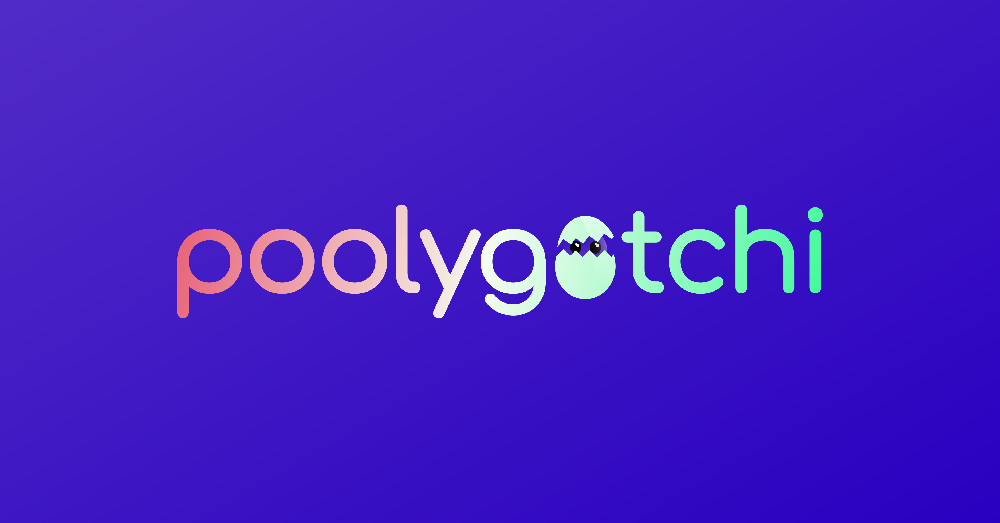

# Poolygotchi

## A gamified interface for the PoolTogether protocol.

## Installation

Clone or fork this repo and run `npm i`. 

## Development

Run `npm run dev` to start the development server.

## Build

When your app is production ready, run the following command to output the static site files to the `docs` directory:

### Linux

`npm run build`

### Windows

`npm run build-win`
